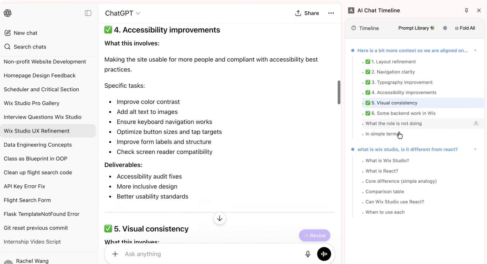

# AI Chat Timeline

[](https://github.com/RachelWanggg/AI-chat-timeline-extension/actions/workflows/test.yml)
[](LICENSE)
[](manifest.json)

A Chrome extension that turns a long ChatGPT or Claude.ai conversation into a navigable
outline in the browser side panel.

**What makes it different:** most chat navigators index only your questions. This one also
parses the `h1`–`h3` headings *inside* each assistant reply, so a 40-message conversation
becomes a two-level table of contents you can jump around — not just a list of prompts.



### Demo

[](https://youtu.be/1KqAzJv59jE)

---

## Features

**Timeline navigation**
- Parses conversation turns in real time and renders them in order
- One click jumps to any user turn or assistant heading
- Highlights the anchor you are currently reading as you scroll
- Per-turn collapse (`▾ / ▸`) and global `⊟ Fold All / ⊞ Unfold All`
- Pin important anchors to a sticky area at the top

**Prompt utilities**
- **Save to Prompt Library** button injected into your own message bubbles
- **✨ Revise** button on a message, rewriting the prompt through the Anthropic API
- **✨ Draft Revise** floating button above the composer, on both platforms

**Prompt Library**
- Create, edit, copy, and delete prompts, with categories, tags, and keyword search

**Other**
- Context usage bar estimating how much of the model's context window the conversation fills
- Light / dark / system theme

---

## Install

No build step — the repository *is* the extension.

1. Clone this repository.
2. Open `chrome://extensions/` and enable **Developer mode**.
3. Click **Load unpacked** and select the project folder.
4. Open `chatgpt.com` or `claude.ai`, then click the extension icon to open the side panel.

To use **Revise**, add an Anthropic API key under **Settings → Revise Settings** in the side
panel. Requests are proxied through the service worker (`background.js`) to avoid the content
page's CSP; the key is stored in `chrome.storage.local` and never leaves the browser except
to `api.anthropic.com`.

---

## Architecture

The interesting problem here is not parsing the DOM — it is scrolling reliably on top of a
virtualized React list that unmounts the element you are trying to scroll to.
[`docs/ARCHITECTURE.md`](docs/ARCHITECTURE.md) covers the data flow, the message protocol, and
why `scrollEngine` positions arithmetically instead of calling `scrollIntoView()`.

| Layer | Choice |
|---|---|
| Extension API | Chrome Manifest V3 |
| UI | Vanilla JS — no framework, no bundler, no build step |
| Persistence | `chrome.storage.local` |
| AI | Anthropic API, proxied through the service worker |
| Tests | Node's built-in `node:test` + jsdom |

<details>
<summary><strong>File structure</strong></summary>

```
├── manifest.json                    # Extension config and permissions
├── background.js                    # Service worker: side panel, tab events, API proxy
├── content.js                       # Entry point: bootstraps the content/ module tree
├── content/
│   ├── index.js                     # Wires modules together, registers message listeners
│   ├── chatgptFetchInterceptor.js   # MAIN-world fetch hook for the full conversation payload
│   ├── adapters/
│   │   ├── adapterFactory.js        # Hostname -> platform adapter
│   │   ├── chatgptAdapter.js        # ChatGPT DOM parsing
│   │   └── claudeAdapter.js         # Claude.ai DOM parsing
│   ├── timeline/
│   │   ├── parser.js                # Parsed turns -> TimelineTurn[]
│   │   ├── anchorManager.js         # anchorId -> the live DOM node
│   │   ├── scrollEngine.js          # The single scrolling authority
│   │   ├── scrollTracker.js         # IntersectionObserver -> active anchor
│   │   ├── tokenEstimator.js        # Heuristic context-usage estimate
│   │   └── timelineController.js    # Orchestrates parse -> send -> observe
│   ├── revise/
│   │   ├── promptBuilder.js         # Builds the revision prompt
│   │   ├── reviseController.js      # Orchestrates the revise flow
│   │   └── reviseService.js         # Sends REVISE_VIA_API to the service worker
│   ├── state/store.js               # Shared mutable state
│   ├── ui/                          # Injected buttons and modals
│   └── utils/                       # Logger and shared constants
├── panel/                           # Side panel: markup, styles, rendering
└── tests/                           # node:test suite
```

</details>

---

## Tests

```bash
npm install
npm test
```

48 tests covering the pure modules: timeline parsing, the context-window token estimator, the
revise prompt builder, adapter resolution, and Claude DOM parsing under jsdom. They run on
every push and pull request via GitHub Actions.

---

## Known limitations

- **Draft Revise → "Use in Composer" does not work on Claude.ai.** Claude's composer is a
  ProseMirror editor, which ignores the `execCommand`-based insertion the extension uses. Use
  the **Copy** button and paste manually. ChatGPT is unaffected.
- The context usage bar is a heuristic estimate, not a tokenizer. It is deliberately
  conservative — it over-counts rather than under-counts.

## Roadmap

- [ ] Bookmark (cross-platform conversation saving)
- [ ] Enter key handling (newline vs. submit toggle)
- [ ] Copy LaTeX
- [ ] `Use in Composer` support on Claude.ai via synthetic ProseMirror events

## License

[MIT](LICENSE)
